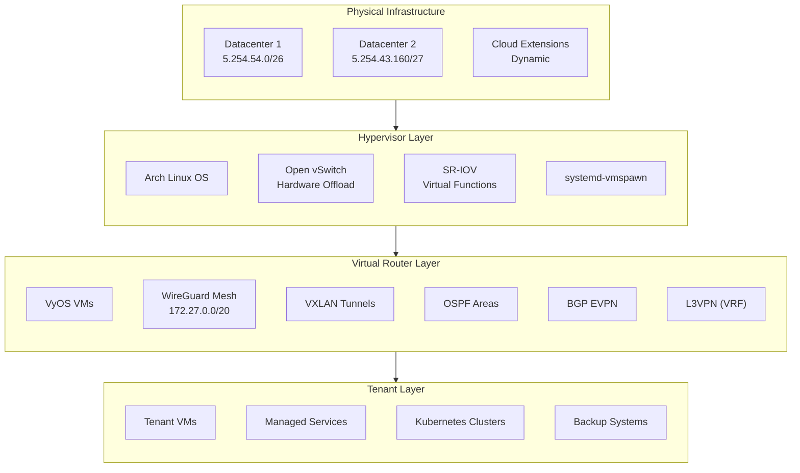
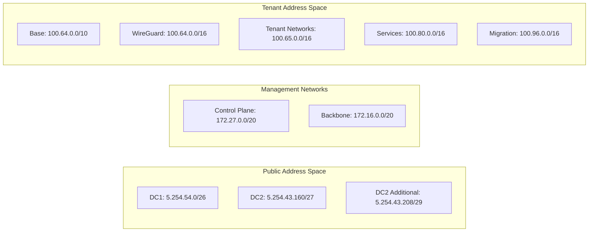
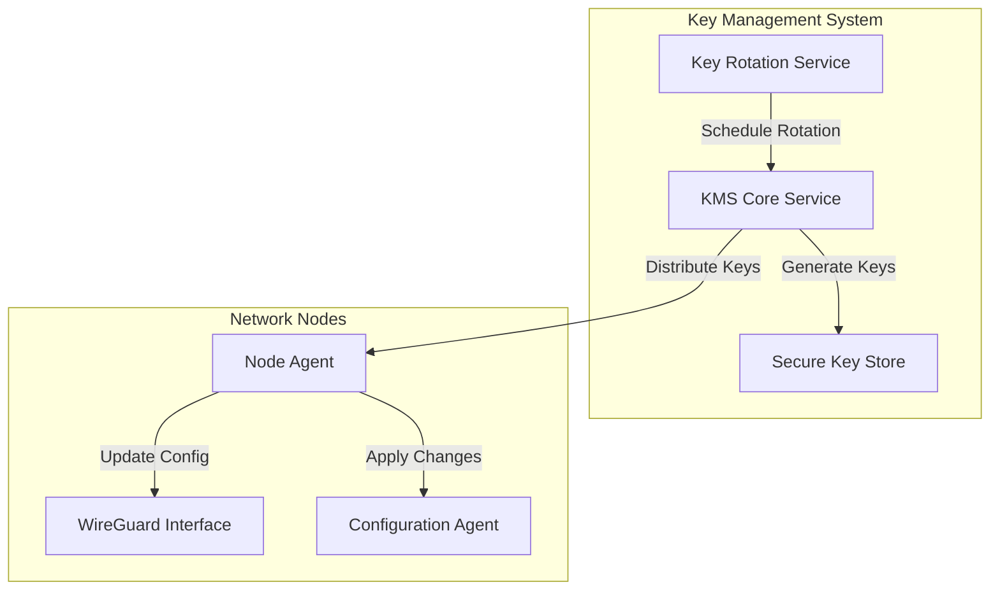
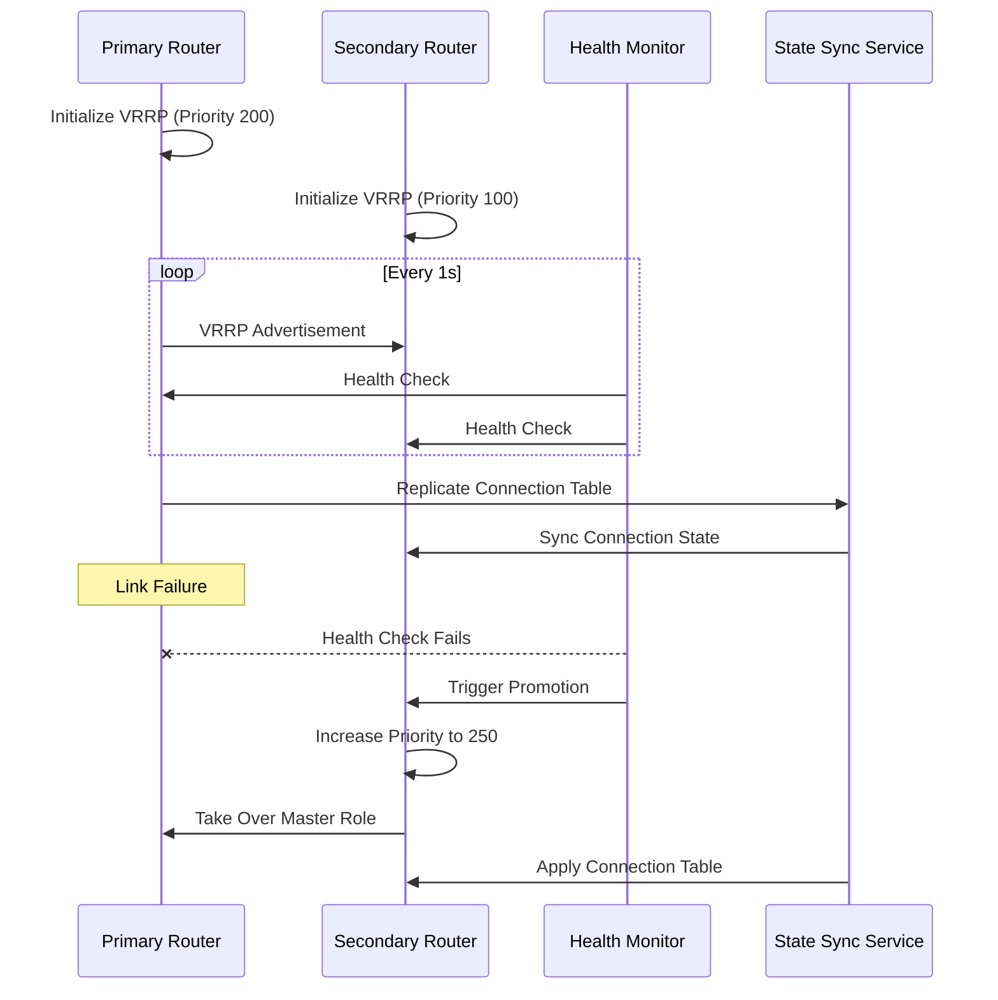
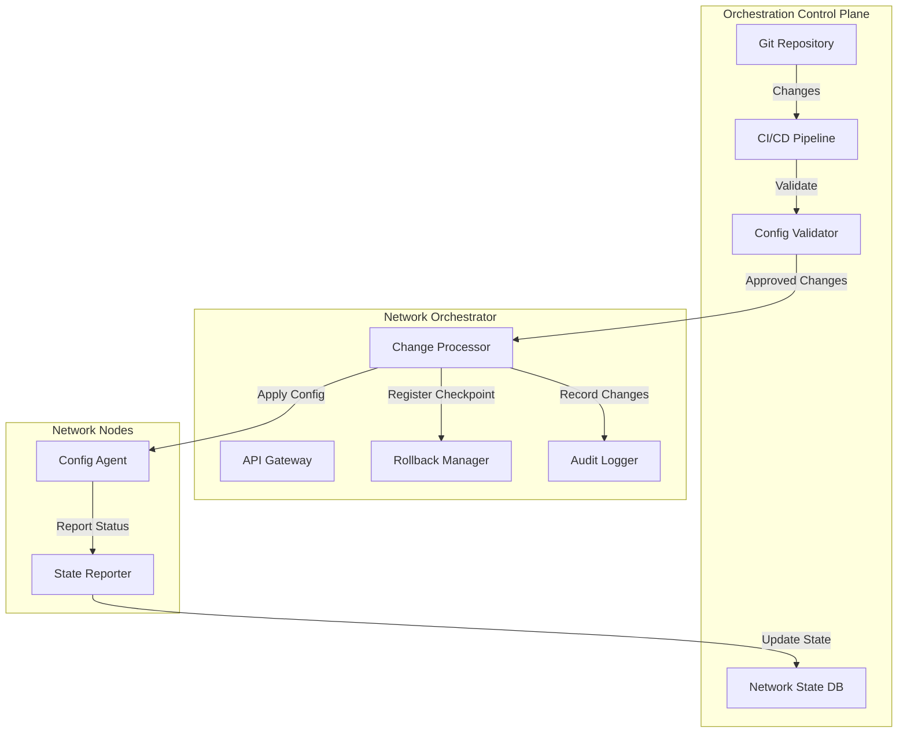
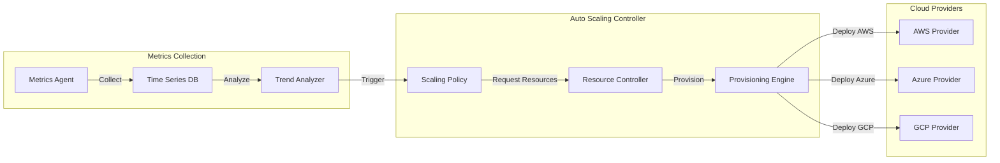
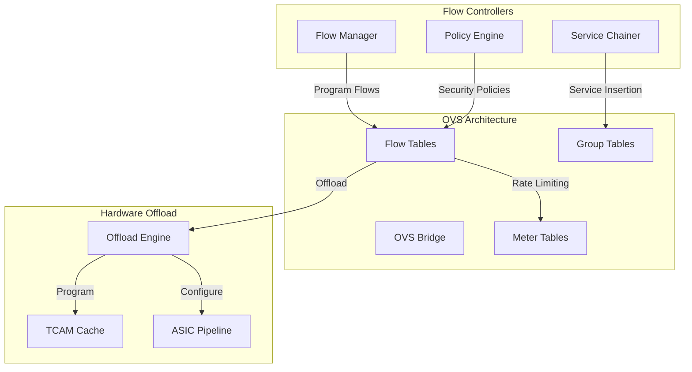
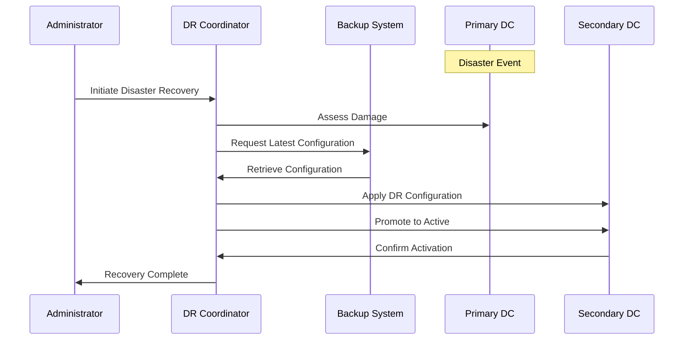
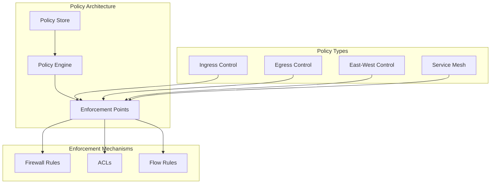
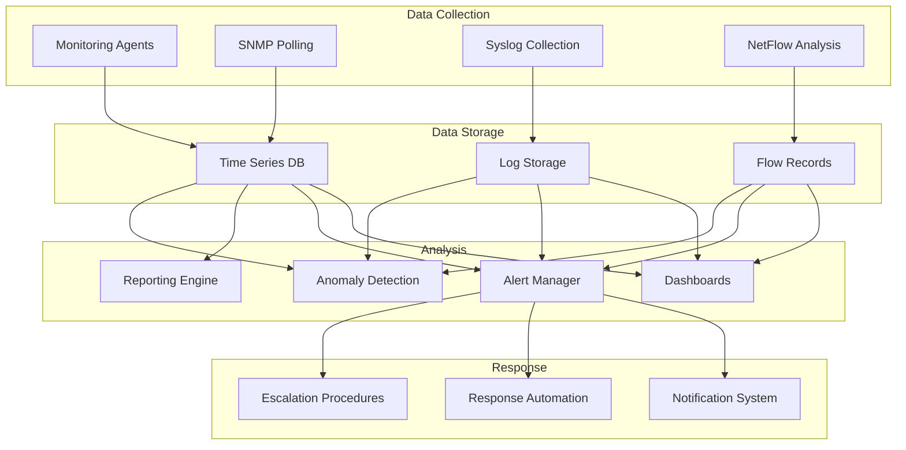

# Comprehensive E2E Encrypted Multi-Tenant Network Architecture

This document synthesizes our complete plan for building a secure, end-to-end encrypted, multi-tenant overlay network using VyOS, WireGuard, VXLAN, OSPF, L3VPN, and other technologies. The architecture implements a Unix philosophy-aligned approach with modular components that can be composed together while maintaining separation of concerns.

## Architecture Overview



## Network Addressing Schema



## Implementation Plan

### 1. Physical Infrastructure Setup

The physical infrastructure consists of:

- **Datacenter 1**: 
  - Public Block: 5.254.54.0/26 (62 usable IPs)
  - Networking: 4x Intel X710 (10G) + 2x Mellanox CX4 (25G)
  - Management: IPMI via dedicated 1GbE NIC

- **Datacenter 2**:
  - Public Block: 5.254.43.160/27 (30 usable IPs)
  - Additional Block: 5.254.43.208/29 (6 usable IPs)
  - Networking: 4x Intel X710 (10G) + 2x Mellanox CX4 (25G)
  - Management: IPMI via dedicated 1GbE NIC

### 2. Hypervisor Layer Configuration

Each bare metal server runs:

1. Arch Linux operating system
2. Open vSwitch with hardware offloading
3. SR-IOV configuration for network cards
4. systemd-vmspawn for VM deployment

**NIC Configuration**:
```bash
#!/bin/bash

# Configure Intel X710 NIC with SR-IOV
for i in {0..3}; do
  echo 7 > /sys/class/net/enp${i}s0/device/sriov_numvfs
  ip link set enp${i}s0 up
done

# Configure Mellanox CX4 NIC with SR-IOV
for i in {4..7}; do
  echo 7 > /sys/class/net/enp${i}s0/device/sriov_numvfs
  ip link set enp${i}s0 up
done

# Configure LACP Bond for Intel NICs
cat > /etc/systemd/network/10-bond0.netdev << EOF
[NetDev]
Name=bond0
Kind=bond

[Bond]
Mode=802.3ad
LACPTransmitRate=fast
MIIMonitorSec=1s
UpDelaySec=2s
DownDelaySec=2s
EOF

# Configure LACP Bond for Mellanox NICs
cat > /etc/systemd/network/20-bond1.netdev << EOF
[NetDev]
Name=bond1
Kind=bond

[Bond]
Mode=802.3ad
LACPTransmitRate=fast
MIIMonitorSec=1s
UpDelaySec=2s
DownDelaySec=2s
EOF

# Configure OVS with hardware offload
cat > /etc/openvswitch/ovs-setup.sh << 'EOF'
#!/bin/bash
ovs-vsctl --may-exist add-br br0
ovs-vsctl set Open_vSwitch . other_config:hw-offload=true
ovs-vsctl add-port br0 bond0
ovs-vsctl add-port br0 bond1
EOF
chmod +x /etc/openvswitch/ovs-setup.sh
```

### 3. VyOS VM Deployment Using mkosi and systemd-vmspawn

Create a base VyOS image using mkosi:

```bash
#!/bin/bash

# Create mkosi configuration
cat > mkosi.default << EOF
[Distribution]
Distribution=vyos
Release=current

[Output]
Format=disk
Output=vyos-base.img
Size=2G

[Partitions]
RootSize=2G
EOF

# Build the image
mkosi

# Create systemd-vmspawn service template
cat > /etc/systemd/system/vyos@.service << EOF
[Unit]
Description=VyOS VM %i
After=network.target

[Service]
Type=notify
ExecStart=/usr/bin/systemd-vmspawn -i /var/lib/machines/vyos-base.img --network-veth -n vyos-%i
ExecStop=/usr/bin/machinectl poweroff vyos-%i
KillMode=mixed
Restart=on-failure
TimeoutStartSec=180

[Install]
WantedBy=multi-user.target
EOF
```

### 4. WireGuard Control Plane Configuration

The secure management and control plane runs over WireGuard:

```bash
# VyOS WireGuard Configuration Template
cat > vyos-wireguard-template.config << EOF
# WireGuard Management Interface
set interfaces wireguard wg0 address '172.27.X.Y/32'
set interfaces wireguard wg0 description 'Secure Control Plane'
set interfaces wireguard wg0 peer ${PEER_ID} allowed-ips '172.27.0.0/20'
set interfaces wireguard wg0 peer ${PEER_ID} persistent-keepalive '25'
set interfaces wireguard wg0 port '51820'
set interfaces wireguard wg0 private-key '${PRIVATE_KEY}'
EOF
```

### 5. BGP EVPN and L3VPN Configuration

The backbone network runs BGP EVPN for control plane and VXLAN for data plane:

```bash
# BGP EVPN Configuration Template
cat > vyos-bgp-evpn-template.config << EOF
# BGP System Configuration
set protocols bgp system-as '65000'
set protocols bgp parameters router-id '${ROUTER_ID}'

# EVPN Configuration
set protocols bgp neighbor ${PEER_IP} remote-as '65000'
set protocols bgp neighbor ${PEER_IP} update-source 'lo'
set protocols bgp neighbor ${PEER_IP} address-family l2vpn-evpn activate
set protocols bgp l2vpn-evpn advertise-all-vni

# L3VPN Configuration 
set vrf name ${TENANT_VRF} table '${VRF_TABLE_ID}'
set vrf name ${TENANT_VRF} protocols bgp address-family ipv4-unicast route-target vpn export '65000:${TENANT_ID}'
set vrf name ${TENANT_VRF} protocols bgp address-family ipv4-unicast route-target vpn import '65000:${TENANT_ID}'
EOF
```

### 6. VXLAN Tunnel Configuration

VXLAN provides the data plane for multi-tenant isolation:

```bash
# VXLAN Configuration Template
cat > vyos-vxlan-template.config << EOF
# VXLAN Interface
set interfaces vxlan vxlan${VNI} vni '${VNI}'
set interfaces vxlan vxlan${VNI} remote '${REMOTE_VTEP}'
set interfaces vxlan vxlan${VNI} source-address '${LOCAL_VTEP}'
set interfaces vxlan vxlan${VNI} mtu '9000'

# Associate VXLAN with VRF
set interfaces vxlan vxlan${VNI} vrf '${TENANT_VRF}'
EOF
```

### 7. High Availability Configuration with VRRP

Implement HA gateways using VRRP:

```bash
# VRRP Configuration Template
cat > vyos-vrrp-template.config << EOF
# VRRP Instance
set high-availability vrrp group ${GROUP_ID} interface '${INTERFACE}'
set high-availability vrrp group ${GROUP_ID} virtual-address '${VIRTUAL_IP}'
set high-availability vrrp group ${GROUP_ID} vrid '${VRID}'
set high-availability vrrp group ${GROUP_ID} priority '${PRIORITY}'
EOF
```

### 8. Tenant Provisioning Automation

Automate tenant onboarding and provisioning with cloud-init:

```yaml
# cloud-init Template for Tenant Provisioning
#cloud-config
vyos_config_commands:
  # Create Tenant VRF
  - set vrf name ${TENANT_VRF} table '${VRF_TABLE_ID}'
  
  # Configure VXLAN for Tenant
  - set interfaces vxlan vxlan${VNI} vni '${VNI}'
  - set interfaces vxlan vxlan${VNI} vrf '${TENANT_VRF}'
  
  # Configure BGP for Tenant
  - set vrf name ${TENANT_VRF} protocols bgp address-family ipv4-unicast route-target vpn export '65000:${TENANT_ID}'
  - set vrf name ${TENANT_VRF} protocols bgp address-family ipv4-unicast route-target vpn import '65000:${TENANT_ID}'
  
  # Configure WireGuard for Tenant
  - set interfaces wireguard wg${TENANT_ID} address '100.64.${TENANT_ID}.1/24'
  - set interfaces wireguard wg${TENANT_ID} vrf '${TENANT_VRF}'
```

## Deployment Workflow

The deployment of this network architecture follows these stages:

1. **Infrastructure Initialization**
   - Deploy bare metal servers
   - Configure SR-IOV and OVS
   - Set up management network

2. **Control Plane Deployment**
   - Deploy VyOS VMs using systemd-vmspawn
   - Configure WireGuard mesh
   - Establish BGP sessions

3. **Tenant Network Provisioning**
   - Create tenant VRFs
   - Configure VXLAN tunnels
   - Set up L3VPN isolation

4. **Service Integration**
   - Deploy tenant VMs
   - Configure managed services
   - Implement backup systems

## API Integration

VyOS provides a rich API for automation:

```bash
#!/bin/bash

# VyOS API Authentication
API_KEY="your-api-key"
VYOS_HOST="10.0.0.1"

# Create Tenant VRF
curl -k -X POST \
  "https://${VYOS_HOST}/configure" \
  -H "X-API-Key: ${API_KEY}" \
  -d '{
    "op": "set",
    "path": ["vrf", "name", "customer-1", "table", "1000"]
  }'

# Configure VXLAN
curl -k -X POST \
  "https://${VYOS_HOST}/configure" \
  -H "X-API-Key: ${API_KEY}" \
  -d '{
    "op": "set",
    "path": ["interfaces", "vxlan", "vxlan10000", "vni", "10000"]
  }'

# Commit Changes
curl -k -X POST \
  "https://${VYOS_HOST}/configure" \
  -H "X-API-Key: ${API_KEY}" \
  -d '{"op": "commit"}'
```

## Real-time Monitoring

The network includes comprehensive monitoring using VyOS's built-in capabilities:

```bash
#!/bin/bash

# Monitor BGP Sessions
curl -k -X GET \
  "https://${VYOS_HOST}/show/bgp/summary/json" \
  -H "X-API-Key: ${API_KEY}"

# Monitor VXLAN Status
curl -k -X GET \
  "https://${VYOS_HOST}/show/interfaces/vxlan/json" \
  -H "X-API-Key: ${API_KEY}"

# Monitor VRF Routing Tables
curl -k -X GET \
  "https://${VYOS_HOST}/show/ip/route/vrf/all/json" \
  -H "X-API-Key: ${API_KEY}"
```

## Key Resources and References

1. **VyOS L3VPN Documentation**
   - [L3VPN VRFs Configuration](https://docs.vyos.io/en/latest/configuration/vrf/index.html#l3vpn-vrfs)
   - [L3VPN EVPN Example](https://docs.vyos.io/en/latest/configexamples/autotest/L3VPN_EVPN/L3VPN_EVPN.html)
   - [L3VPN Hub-and-Spoke](https://docs.vyos.io/en/latest/configexamples/l3vpn-hub-and-spoke.html)

2. **WireGuard Configuration**
   - [WireGuard Basic Setup](https://docs.vyos.io/en/latest/configexamples/autotest/Wireguard/Wireguard.html)
   - [OSPF over WireGuard](https://docs.vyos.io/en/latest/configexamples/ha.html#ospf-over-wireguard)

3. **VRF and Routing**
   - [Inter-VRF Routing](https://docs.vyos.io/en/latest/configexamples/inter-vrf-routing-vrf-lite.html)
   - [OSPF Unnumbered](https://docs.vyos.io/en/latest/configexamples/ospf-unnumbered.html)
   - [DMVPN Dual-Hub Dual-Cloud](https://docs.vyos.io/en/latest/configexamples/dmvpn-dualhub-dualcloud.html)

4. **Automation and API**
   - [VyOS API Documentation](https://docs.vyos.io/en/latest/automation/vyos-api.html)
   - [HTTP API Configuration](https://docs.vyos.io/en/latest/configuration/service/https.html#http-api)
   - [Remote Command Execution](https://docs.vyos.io/en/latest/automation/command-scripting.html#run-commands-remotely)
   - [Cloud-Init Integration](https://docs.vyos.io/en/latest/automation/cloud-init.html)
   - [Cloud-Config File Format](https://docs.vyos.io/en/latest/automation/cloud-init.html#cloud-config-file-format)

## Dynamic Key Management System

The architecture implements an automated key management system for secure credential handling:



The key management system operates on these principles:

1. **Time-Based Rotation**
   - Keys are automatically rotated on a configurable schedule (default: 7 days)
   - Rotation is staggered across nodes to prevent network-wide disruption
   - Old keys remain valid for a grace period to prevent connection loss

2. **Secure Distribution**
   - Keys are distributed over existing WireGuard tunnels
   - Distribution uses TLS with certificate pinning
   - Key material is never logged or stored in plain text

3. **Implementation**

```bash
#!/bin/bash

# Key Management Service Configuration
cat > /etc/kms/config.yaml << EOF
service:
  listen_address: 172.27.0.1
  listen_port: 8443
  tls_cert: /etc/kms/certs/server.crt
  tls_key: /etc/kms/certs/server.key

rotation:
  schedule: "0 0 * * 0"  # Weekly on Sunday at midnight
  grace_period: 48h      # Old keys valid for 48 hours after rotation
  
storage:
  type: encrypted_file
  path: /etc/kms/keystore
  passphrase_file: /etc/kms/passphrase
  
nodes:
  - id: vyos-dc1-01
    address: 172.27.1.1
    group: dc1
  - id: vyos-dc1-02
    address: 172.27.1.2
    group: dc1
  - id: vyos-dc2-01
    address: 172.27.2.1
    group: dc2
EOF

# Node Agent Configuration
cat > /etc/kms/agent.yaml << EOF
server:
  address: 172.27.0.1
  port: 8443
  ca_cert: /etc/kms/certs/ca.crt
  
node:
  id: ${NODE_ID}
  group: ${NODE_GROUP}
  
wireguard:
  interface: wg0
  config_path: /etc/wireguard/wg0.conf
  
vyos:
  api_endpoint: https://localhost/configure
  api_key_file: /etc/kms/vyos_api_key
EOF
```

## In-depth VRRP Failover Mechanisms

The architecture implements a sophisticated high availability system using VRRP with enhanced state synchronization:



The VRRP implementation includes:

1. **Advanced Failure Detection**
   - Multiple tracking mechanisms (interface, route, script)
   - BFD integration for sub-second failure detection
   - Customizable thresholds for preemption

2. **State Synchronization**
   - Connection tracking table synchronization
   - BGP session state preservation
   - Route consistency verification

3. **Implementation**

```bash
# VRRP with Advanced Features
cat > vyos-ha-template.config << EOF
# VRRP Base Configuration
set high-availability vrrp group ${GROUP_ID} interface '${INTERFACE}'
set high-availability vrrp group ${GROUP_ID} virtual-address '${VIRTUAL_IP}'
set high-availability vrrp group ${GROUP_ID} vrid '${VRID}'
set high-availability vrrp group ${GROUP_ID} priority '${PRIORITY}'

# Failure Detection
set high-availability vrrp group ${GROUP_ID} track interface '${TRACKED_INTERFACE}' weight '50'
set high-availability vrrp group ${GROUP_ID} track route '${TRACKED_ROUTE}' weight '50'
set high-availability vrrp group ${GROUP_ID} track script '${HEALTH_SCRIPT}' weight '50'

# BFD Integration
set protocols bfd peer ${PEER_IP} multihop
set protocols bfd peer ${PEER_IP} source ${LOCAL_IP}
set protocols bfd peer ${PEER_IP} interval transmit-interval 300 receive-interval 300 multiplier 3
set high-availability vrrp group ${GROUP_ID} track bfd peer ${PEER_IP} weight '100'

# State Synchronization
set high-availability vrrp sync-group ${SYNC_GROUP} member '${GROUP_ID}'
set high-availability vrrp sync-group ${SYNC_GROUP} conntrack-sync
set high-availability vrrp sync-group ${SYNC_GROUP} conntrack-sync interface '${SYNC_INTERFACE}'
set high-availability vrrp sync-group ${SYNC_GROUP} conntrack-sync mcast-group '225.0.0.50'
EOF
```

## Orchestration Framework

The architecture includes a comprehensive orchestration framework for centralized management:



The orchestration system includes:

1. **GitOps-based Configuration Management**
   - Network configuration as code
   - Change approval workflows
   - Automated validation and testing

2. **Centralized Policy Control**
   - Network-wide policy definition
   - Automated policy translation
   - Compliance verification

3. **Implementation**

```bash
#!/bin/bash

# Orchestrator Configuration
cat > /etc/orchestrator/config.yaml << EOF
api:
  listen_address: 0.0.0.0
  listen_port: 8080
  tls_cert: /etc/orchestrator/certs/server.crt
  tls_key: /etc/orchestrator/certs/server.key
  
git:
  repository: git@github.com:example/network-config.git
  branch: main
  poll_interval: 60s
  ssh_key: /etc/orchestrator/ssh/id_rsa
  
validation:
  pre_apply_hooks:
    - syntax_check
    - policy_check
    - simulation
  
rollback:
  enabled: true
  automatic: true
  snapshots_to_keep: 10
  
nodes:
  - id: vyos-dc1-01
    type: vyos
    address: 172.27.1.1
    api_key: ${API_KEY_DC1_01}
  - id: vyos-dc1-02
    type: vyos
    address: 172.27.1.2
    api_key: ${API_KEY_DC1_02}
EOF
```

## Autoscaling Mechanisms

The architecture implements an advanced autoscaling system for dynamic cloud extension:



The autoscaling system includes:

1. **Threshold-based Scaling**
   - CPU/Memory/Network utilization triggers
   - Predictive scaling based on traffic patterns
   - Time-scheduled scaling for known busy periods

2. **Multi-Cloud Orchestration**
   - Dynamic resource allocation across cloud providers
   - Cost-optimized provisioning
   - Location-aware deployment

3. **Implementation**

```bash
#!/bin/bash

# Autoscaler Configuration
cat > /etc/autoscaler/config.yaml << EOF
metrics:
  collection_interval: 60s
  retention_period: 30d
  datasources:
    - type: prometheus
      url: http://prometheus:9090
    - type: cloudwatch
      region: us-west-2
      access_key: ${AWS_ACCESS_KEY}
      secret_key: ${AWS_SECRET_KEY}
      
scaling:
  policies:
    - name: cpu-utilization
      metric: system.cpu.utilization
      threshold: 75
      duration: 5m
      scale_increment: 1
    - name: bandwidth-utilization
      metric: network.bandwidth.utilization
      threshold: 80
      duration: 5m
      scale_increment: 1
  
  cool_down_period: 10m
  min_nodes: 1
  max_nodes: 10
  
providers:
  - type: aws
    regions:
      - us-west-2
      - us-east-1
    instance_type: t3.medium
    image_id: ami-123456
    
  - type: azure
    regions:
      - westus2
      - eastus
    vm_size: Standard_D2s_v3
    image: /subscriptions/xxx/resourceGroups/yyy/providers/Microsoft.Compute/images/vyos-image
    
  - type: gcp
    regions:
      - us-west1
      - us-east1
    machine_type: n2-standard-2
    image: projects/vyos-project/global/images/vyos-image
EOF
```

## OVS Flow Programming Details

The architecture implements sophisticated OVS flow programming for hardware-accelerated packet processing:



The OVS implementation includes:

1. **Hardware-Accelerated Flows**
   - ASIC-offloaded packet processing
   - TCAM-optimized flow rules
   - SR-IOV passthrough integration

2. **Advanced Service Insertion**
   - Dynamic service chaining
   - Policy-based traffic steering
   - Micro-segmentation

3. **Implementation**

```bash
#!/bin/bash

# OVS Configuration Script
cat > /etc/openvswitch/flows-setup.sh << 'EOF'
#!/bin/bash

# Enable Hardware Offload
ovs-vsctl set Open_vSwitch . other_config:hw-offload=true

# Create Bridge
ovs-vsctl --may-exist add-br br0

# Add Physical Ports
ovs-vsctl --may-exist add-port br0 bond0
ovs-vsctl --may-exist add-port br0 bond1

# Configure OpenFlow Version
ovs-vsctl set bridge br0 protocols=OpenFlow13

# VXLAN Tenant Isolation Flows
for tenant_id in {1..100}; do
  vni=$((10000 + $tenant_id))
  
  # Create VXLAN port
  ovs-vsctl --may-exist add-port br0 vxlan${tenant_id} \
    -- set interface vxlan${tenant_id} type=vxlan \
    options:remote_ip=flow options:key=${vni}
  
  # Match tenant traffic and set VXLAN tunnel
  ovs-ofctl add-flow br0 "table=0, priority=100, metadata=${tenant_id}, \
    actions=set_field:${vni}->tun_id,resubmit(,10)"
  
  # Classify incoming VXLAN traffic to tenant
  ovs-ofctl add-flow br0 "table=0, priority=100, tun_id=${vni}, \
    actions=set_field:${tenant_id}->metadata,resubmit(,20)"
done

# Security Groups Implementation
ovs-ofctl add-flow br0 "table=20, priority=200, metadata=1, \
  dl_type=0x0800, nw_proto=6, tp_dst=22, actions=drop"

# QoS Implementation
ovs-ofctl add-meter br0 "meter=1 pktps burst stats bands=type=drop rate=1000"
ovs-ofctl add-flow br0 "table=30, priority=100, metadata=2, \
  actions=meter:1,resubmit(,40)"

# Hardware Offload Eligibility
ovs-vsctl set Open_vSwitch . other_config:max-idle=60000
ovs-dpctl set-flow-offload-status on
EOF

chmod +x /etc/openvswitch/flows-setup.sh
```

## Complete Disaster Recovery Procedures

The architecture implements comprehensive disaster recovery procedures:



The disaster recovery system includes:

1. **Automated Recovery Process**
   - Predefined recovery procedures
   - Configuration backup and restore
   - Service dependency mapping

2. **Geographic Redundancy**
   - Cross-datacenter replication
   - Cloud-based backup options
   - Multi-region deployment

3. **Implementation**

```bash
#!/bin/bash

# DR Coordinator Configuration
cat > /etc/dr/config.yaml << EOF
backup:
  schedule: "0 * * * *"  # Hourly backups
  retention:
    hourly: 24
    daily: 7
    weekly: 4
    monthly: 3
  storage:
    type: s3
    bucket: network-backups
    prefix: vyos-configs
    region: us-west-2
    
recovery:
  runbooks:
    - name: full-dc-failover
      description: "Complete datacenter failover procedure"
      steps:
        - name: assess-primary
          action: check_connectivity
          targets: [dc1-router1, dc1-router2]
          timeout: 60s
          
        - name: retrieve-config
          action: get_latest_backup
          timeout: 120s
          
        - name: apply-config
          action: apply_configuration
          targets: [dc2-router1, dc2-router2]
          timeout: 300s
          
        - name: update-dns
          action: update_dns_records
          timeout: 180s
          
        - name: verify-services
          action: check_services
          targets: [web, dns, vpn]
          timeout: 300s
          
monitoring:
  checks:
    - name: bgp-sessions
      interval: 30s
      threshold: 3
      command: "show ip bgp summary"
      expect: "Established"
      
    - name: hardware-health
      interval: 60s
      threshold: 2
      command: "show system integrity"
      expect: "All tests passed"
EOF
```

## Tenant Access Control Policies

The architecture implements sophisticated tenant access control policies:



The access control system includes:

1. **Policy-as-Code Framework**
   - Declarative policy definition
   - Version-controlled policies
   - Automated policy translation

2. **Granular Access Controls**
   - Layer 3-7 filtering
   - Application-aware inspection
   - Time-based access controls

3. **Implementation**

```yaml
# Tenant Access Policy Example
tenant_policies:
  - tenant_id: tenant1
    name: "Finance Department"
    default_action: drop
    rules:
      - id: 1
        description: "Allow Web Traffic"
        action: accept
        protocol: tcp
        destination_port: 443
        source:
          type: any
        destination:
          type: service
          service: web-servers
      
      - id: 2
        description: "Allow Database Access"
        action: accept
        protocol: tcp
        destination_port: 5432
        source:
          type: service
          service: web-servers
        destination:
          type: service
          service: database-servers
          
      - id: 3
        description: "Block External SSH"
        action: drop
        protocol: tcp
        destination_port: 22
        source:
          type: external
        destination:
          type: any
          
    services:
      - id: web-servers
        addresses:
          - 100.64.1.10/32
          - 100.64.1.11/32
          
      - id: database-servers
        addresses:
          - 100.64.1.20/32
          - 100.64.1.21/32
```

## Monitoring and Alerting Infrastructure

The architecture implements a comprehensive monitoring and alerting system:



The monitoring system includes:

1. **Multi-dimensional Metrics**
   - Performance monitoring (CPU, memory, interfaces)
   - Network flow analysis
   - Service availability checks

2. **Intelligent Alerting**
   - Dynamic thresholds
   - Correlation-based alerting
   - Business impact assessment

3. **Implementation**

```yaml
# Monitoring Configuration
monitoring:
  collection:
    interval: 60s
    retention:
      high_resolution: 24h
      medium_resolution: 7d
      low_resolution: 90d
      
  metrics:
    - name: interface_utilization
      description: "Network interface utilization percentage"
      type: gauge
      collection:
        command: "show interfaces"
        parse: regex
        pattern: "RX: (\d+) bytes, TX: (\d+) bytes"
      thresholds:
        warning: 70
        critical: 85
        duration: 5m
        
    - name: bgp_session_status
      description: "BGP session state"
      type: state
      collection:
        command: "show ip bgp summary"
        parse: json
        field: "peers.*.state"
      thresholds:
        warning: "Connect"
        critical: "Idle"
        duration: 2m
        
    - name: memory_utilization
      description: "System memory utilization"
      type: gauge
      collection:
        command: "show system memory"
        parse: json
        field: "memory.used_percent"
      thresholds:
        warning: 80
        critical: 90
        duration: 5m
        
  alerting:
    routes:
      - name: critical
        targets:
          - type: email
            address: network-ops@example.com
          - type: pagerduty
            service_key: 1234567890abcdef
            
      - name: warning
        targets:
          - type: email
            address: monitoring@example.com
          - type: slack
            webhook: https://hooks.slack.com/services/XXX/YYY/ZZZ
            
  dashboards:
    - name: Network Overview
      panels:
        - title: Interface Utilization
          type: graph
          metrics: 
            - interface_utilization
          
        - title: BGP Session Status
          type: state
          metrics:
            - bgp_session_status
```

## Next Steps and Enhancements

1. **Implement CI/CD Pipeline**
   - Develop GitOps workflows for network configuration
   - Implement configuration validation
   - Create automated testing framework

2. **Extend Cloud Provider Integration**
   - Add AWS VPC integration
   - Add Azure VNET integration
   - Add GCP VPC integration

3. **Enhance Security Features**
   - Implement key rotation automation
   - Deploy IDS/IPS capabilities
   - Implement traffic analysis

4. **Improve Tenant Self-Service**
   - Develop tenant portal
   - Implement API for tenant management
   - Create documentation system

## Conclusion

This architecture provides a robust, secure, and scalable network overlay that:

1. Follows Unix philosophy principles of modular, composable components
2. Implements end-to-end encryption with WireGuard
3. Enables secure multi-tenancy through VRF isolation
4. Supports dynamic scaling to cloud providers
5. Leverages automation for deployment and management

By combining the strengths of VyOS, WireGuard, EVPN, and L3VPN technologies, this design creates a network infrastructure that balances security, performance, and operational simplicity.
